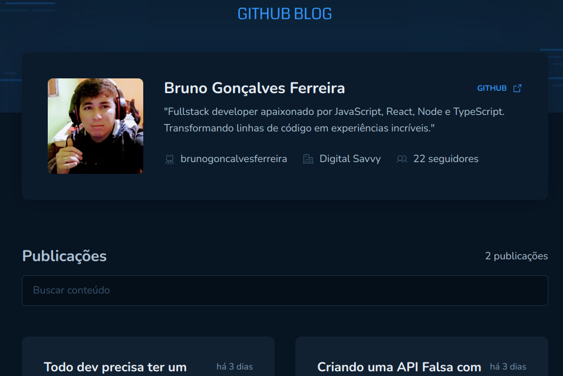
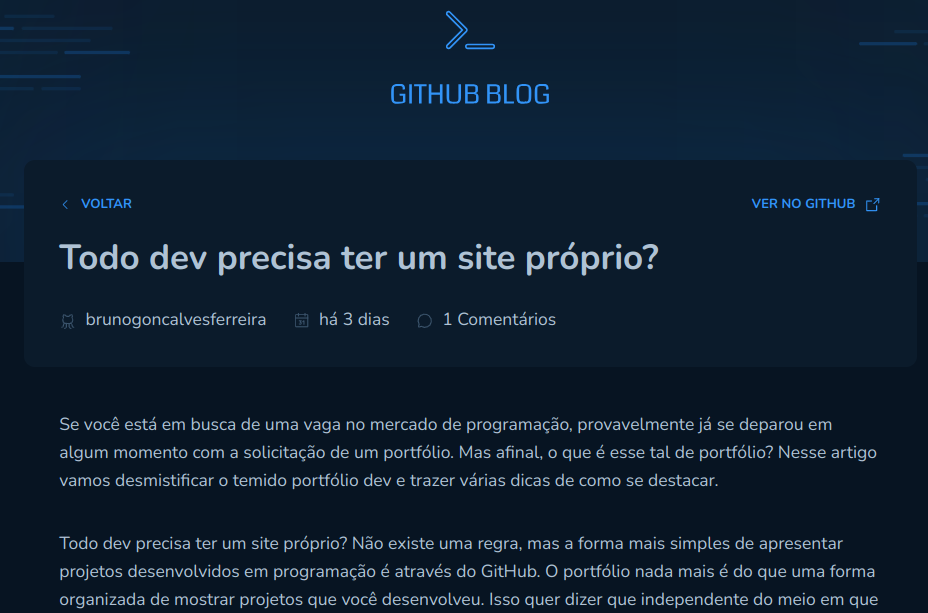

# Projeto 4 ignite - Github Blog

Neste projeto praticamos a utilização de clientes HTTP consumindo a API do Github para criar um blog pessoal.

<br>




<br>

## Tecnologias

Abaixo tecnologias usadas no projeto:

- React
- Typescript
- Styled Components
- API Github
- React Hook Form
- React Router Dom
- Zod
- Axios
- Context API

Trabalhamos nesse projeto com o Hook nativo do React:

- useCallback

## Para rodar a aplicação

> Clone o repositório
```
  git clone https://github.com/brunogoncalvesferreira/github_blog.git
```

> Acesse a pasta
```
  cd github_blog
```

> Instale as dependências
```
  npm install
```

> Rodar aplicação
```
  npm run dev
```

A aplicação está rodando em http://localhost:3000